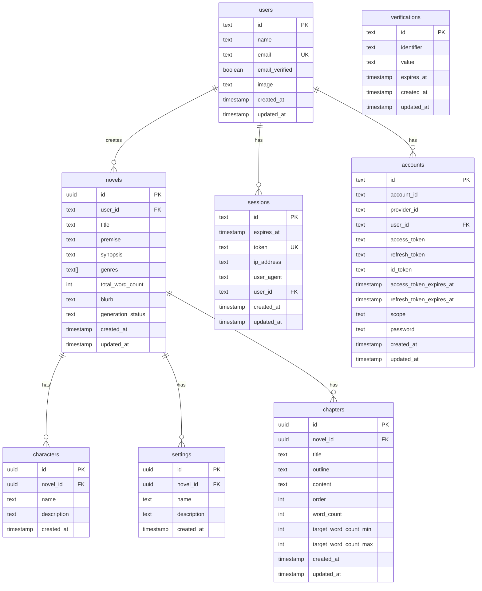
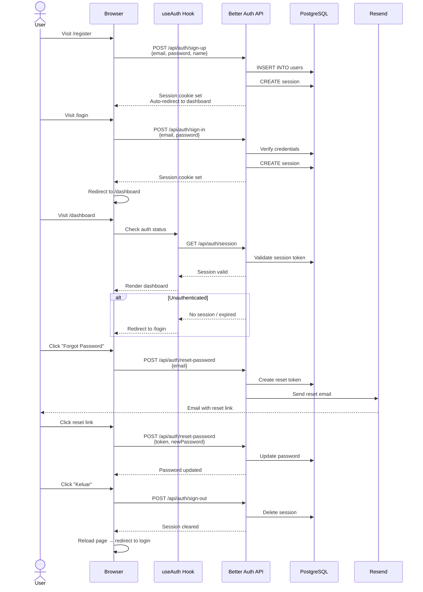

# Novyl AI

<p align="center">
  <strong>AI Novel Ghostwriter Platform</strong>
</p>

<p align="center">
  Write bestselling novels faster with AI. A structured, editor-first platform for novel writers.
</p>

<p align="center">
  
  
  
  
  
  
  
</p>

---

## Table of Contents

- [Overview](#overview)
- [Features](#features)
- [Tech Stack](#tech-stack)
- [Architecture](#architecture)
  - [System Flowchart](#system-flowchart)
  - [AI Generation Sequence](#ai-generation-sequence)
  - [Database ERD](#database-erd)
  - [Authentication Flow](#authentication-flow)
- [Prerequisites](#prerequisites)
- [Getting Started](#getting-started)
  - [1. Clone & Install](#1-clone--install)
  - [2. Environment Variables](#2-environment-variables)
  - [3. Database Setup](#3-database-setup)
  - [4. Running the App](#4-running-the-app)
- [Project Structure](#project-structure)
- [Authentication](#authentication)
- [Database Schema](#database-schema)
- [API Routes](#api-routes)
- [AI Generation System](#ai-generation-system)
- [Environment Variables Reference](#environment-variables-reference)
- [Development Workflow](#development-workflow)
- [Deployment](#deployment)
- [Troubleshooting](#troubleshooting)
- [License](#license)

---

## Overview

Novyl AI is a full-stack web application designed to help writers create novels faster using AI-assisted tools. The platform provides a structured workflow for managing novels, chapters, characters, and settings — all within a clean, distraction-free editor interface.

**Key Philosophy:**
- **Editor-first approach** — Focus on writing, not configuration
- **Client-driven AI orchestration** — The browser tab controls AI generation lifecycle; open tab = generate, close tab = stop, reopen = resume
- **Structured workflow** — Built-in support for premise, synopsis, characters, settings, and AI-generated content
- **Responsive design** — Fully functional on desktop, tablet, and mobile
- **Black & white aesthetic** — Minimal, distraction-free UI using Geist Sans and Geist Mono fonts

---

## Features

### Authentication
- Email/password registration and login
- Password reset flow via email (Resend)
- Session-based authentication with Better Auth
- Protected dashboard routes

### Novel Management
- **7-Step Novel Creation Wizard:**
  1. Title input
  2. Genre selection (11 genres)
  3. Premise writing
  4. Synopsis writing
  5. Character management (add/remove)
  6. Setting management (add/remove)
  7. Chapter outline & summary review
- Responsive wizard with Framer Motion transitions
- Novel grid dashboard with search functionality
- 3D book cover with hover animations
- Informative generation status badges (character count, setting count, chapter progress)

### AI-Powered Novel Generation
- **Client-driven orchestration** — Browser tab is the orchestrator; no background jobs needed
- **Atomic, idempotent API steps** — Each step (characters, settings, chapters, blurb) is a separate API call that skips if already generated
- **Real-time progress** — Live banner showing current step, chapter progress with progress bar
- **Auto-resume** — If tab is closed during generation, reopening resumes from the last uncompleted step
- **Cancel & retry** — One-click cancellation and retry for failed generations
- **Per-chapter regeneration** — Regenerate individual chapters without affecting others
- **Batch chapter writing** — Non-streaming batch generation for reliable chapter output

### Novel Editor
- Chapter-based editor with title, outline, and content
- Auto-save with 1-second debounce
- Progressive blur overlays for scroll fade effects
- Floating navigation pills for quick chapter switching
- Mobile swipe gestures for chapter navigation
- Chapter creation, deletion, and renaming
- Novel deletion with confirmation dialog
- Info dialog showing novel metadata, characters, settings, and generation status

### UI/UX
- shadcn/ui component system
- Skeleton loading states
- Toast notifications (Sonner)
- Accessible design (ARIA labels, keyboard navigation)
- Mobile-first responsive design
- Micro-interactions and active states on all buttons

---

## Tech Stack

| Layer | Technology |
|-------|-----------|
| **Framework** | Next.js 16 (App Router, React Server Components) |
| **Language** | TypeScript 5 |
| **Styling** | Tailwind CSS v4, shadcn/ui |
| **Fonts** | Geist Sans (UI), Geist Mono (editor) |
| **Database** | PostgreSQL (Supabase) |
| **ORM** | Drizzle ORM with Drizzle Kit |
| **Auth** | Better Auth (email/password, session-based) |
| **Email** | Resend (lazy-loaded) |
| **AI** | OpenRouter SDK (x-ai/grok-4.1-fast primary, deepseek/deepseek-v4-flash fallback) |
| **Animation** | Framer Motion |
| **Icons** | Lucide React |
| **Validation** | Zod (via Better Auth) |

---

## Architecture

### System Flowchart

```mermaid
flowchart TB
    subgraph Client["Client (Browser)"]
        Browser["Browser Tab"]
        AuthHook["useAuth Hook"]
        GenHook["useGeneration Hook<br/>(Orchestrator)"]
        Banner["GenerationBanner"]
        Editor["Novel Editor"]
        Dashboard["Dashboard"]
    end

    subgraph NextJS["Next.js App Router"]
        subgraph AuthRoutes["Auth Routes"]
            Login["/login"]
            Register["/register"]
            ResetPw["/reset-password"]
        end

        subgraph DashboardRoutes["Dashboard Routes (Protected)"]
            DashPage["/dashboard"]
            CreatePage["/novel/create"]
            EditPage["/novel/[id]/edit"]
        end

        subgraph APIRoutes["API Routes"]
            BetterAuth["/api/auth/[...all]"]
            GenStart["/api/novels/[id]/generate"]
            GenChars["/api/novels/[id]/generate/characters"]
            GenSett["/api/novels/[id]/generate/settings"]
            GenChap["/api/novels/[id]/generate/chapters/[chapterId]"]
            GenBlurb["/api/novels/[id]/generate/blurb"]
            GenCancel["/api/novels/[id]/generate/cancel"]
            GenStatus["/api/novels/[id]/generate/status"]
        end

        subgraph ServerActions["Server Actions"]
            NovelActions["novel-actions.ts"]
            ChapterActions["chapter-actions.ts"]
            CharacterActions["character-actions.ts"]
            SettingActions["setting-actions.ts"]
        end
    end

    subgraph Backend["Backend Services"]
        AuthLib["Better Auth"]
        DB[("PostgreSQL<br/>via Drizzle ORM")]
        OpenRouter[("OpenRouter AI<br/>x-ai/grok-4.1-fast")]
        Resend[("Resend<br/>Email Service")]
    end

    Browser --> AuthHook
    AuthHook --> BetterAuth
    BetterAuth --> AuthLib
    AuthLib --> DB

    Browser --> Dashboard
    Dashboard --> NovelActions
    NovelActions --> DB

    Browser --> Editor
    Editor --> ChapterActions
    ChapterActions --> DB

    Browser --> GenHook
    GenHook --> GenStart
    GenHook --> GenChars
    GenHook --> GenSett
    GenHook --> GenChap
    GenHook --> GenBlurb
    GenHook --> GenCancel

    GenStart --> DB
    GenChars --> OpenRouter
    GenChars --> DB
    GenSett --> OpenRouter
    GenSett --> DB
    GenChap --> OpenRouter
    GenChap --> DB
    GenBlurb --> OpenRouter
    GenBlurb --> DB
    GenCancel --> DB

    GenHook --> Banner
```



### AI Generation Sequence

```mermaid
sequenceDiagram
    actor User
    participant Browser as Browser Tab
    participant Hook as useGeneration Hook
    participant Banner as GenerationBanner
    participant API as Next.js API Routes
    participant AI as OpenRouter AI
    participant DB as PostgreSQL

    Note over User,DB: Client-Driven Orchestration<br/>Tab Open = Generate | Tab Close = Stop

    User->>Browser: Open novel editor
    Browser->>API: GET /api/novels/[id]
    API->>DB: Fetch novel + chapters + characters + settings
    DB-->>API: Novel data
    API-->>Browser: Return novel detail

    alt Novel has stale "generating" status
        Browser->>Hook: Check content completeness
        Hook->>Hook: All content exists?<br/>Skip API calls
        Hook->>Banner: Show "Completed" state
    else Novel needs generation
        User->>Banner: Click "Generate"
        Banner->>Hook: startGeneration()
        Hook->>API: POST /generate (set status = "generating")
        API->>DB: UPDATE novels SET generationStatus = "generating"

        Hook->>API: POST /generate/characters
        API->>DB: Check existing characters
        alt Characters exist
            DB-->>API: Return existing (skip)
        else No characters
            API->>AI: Generate characters via OpenRouter
            AI-->>API: JSON character list
            API->>DB: INSERT characters
        end
        API-->>Hook: Return characters
        Hook->>Browser: onStepComplete({characters})
        Browser->>Browser: Update UI with new characters

        Hook->>API: POST /generate/settings
        API->>DB: Check existing settings
        alt Settings exist
            DB-->>API: Return existing (skip)
        else No settings
            API->>AI: Generate settings via OpenRouter
            AI-->>API: JSON setting list
            API->>DB: INSERT settings
        end
        API-->>Hook: Return settings
        Hook->>Browser: onStepComplete({settings})
        Browser->>Browser: Update UI with new settings

        loop For each chapter without content
            Hook->>API: POST /generate/chapters/[chapterId]
            API->>DB: Check chapter content
            alt Content exists
                DB-->>API: Return existing (skip)
            else No content
                API->>DB: Fetch characters + settings + previous chapters
                DB-->>API: Context data
                API->>AI: Generate chapter with full context
                AI-->>API: Chapter text
                API->>DB: UPDATE chapters SET content, wordCount
                API->>DB: UPDATE novels SET totalWordCount
            end
            API-->>Hook: Return chapter + totalWordCount
            Hook->>Browser: onStepComplete({chapter})
            Browser->>Browser: Update chapter content in editor
        end

        Hook->>API: POST /generate/blurb
        API->>DB: Check existing blurb
        alt Blurb exists
            DB-->>API: Return existing (skip)
        else No blurb
            API->>AI: Generate blurb via OpenRouter
            AI-->>API: Blurb text
            API->>DB: UPDATE novels SET blurb
        end
        API-->>Hook: Return blurb
        Hook->>Browser: onStepComplete({blurb})

        Hook->>API: POST /generate (set status = "completed")
        API->>DB: UPDATE novels SET generationStatus = "completed"
        Hook->>Banner: Show "Completed" state
        Hook->>Browser: onGenerationComplete()
    end

    alt User closes tab mid-generation
        Note over Browser: Tab closed →<br/>AbortController triggers<br/>fetch cancellation
        Hook->>API: [Pending requests cancelled]
        API->>DB: [Partial data saved]<br/>Status remains "generating"
    end

    alt User reopens tab later
        Browser->>API: GET /api/novels/[id]
        API-->>Browser: Novel with "generating" status
        Browser->>Hook: Detect "generating" + not isGenerating
        Hook->>Hook: Check what content is missing
        Hook->>API: Resume from first missing step
    end

    alt User clicks Cancel
        User->>Banner: Click "Batal"
        Banner->>Hook: cancelGeneration()
        Hook->>Hook: AbortController.abort()
        Hook->>API: POST /generate/cancel
        API->>DB: UPDATE novels SET generationStatus = "idle"
        Hook->>Banner: Show idle state
    end
```



### Database ERD



### Authentication Flow



---

## Prerequisites

Before you begin, ensure you have the following installed:

- **Node.js** `>= 20.0.0` (recommended: use [nvm](https://github.com/nvm-sh/nvm))
- **npm** `>= 10.0.0` (comes with Node.js)
- **PostgreSQL** database (local or cloud — [Supabase](https://supabase.com) recommended)
- **Git** for version control
- **OpenRouter API Key** — Required for AI generation features ([Get one here](https://openrouter.ai/keys))

### Recommended Tools
- [VS Code](https://code.visualstudio.com/) with extensions:
  - Tailwind CSS IntelliSense
  - TypeScript Importer
  - ESLint

---

## Getting Started

### 1. Clone & Install

```bash
# Clone the repository
git clone <repository-url>
cd novyl

# Install dependencies
npm install
```

### 2. Environment Variables

Copy the example environment file and fill in your values:

```bash
cp .env.example .env
```

Edit `.env` with your configuration (see [Environment Variables Reference](#environment-variables-reference) below).

### 3. Database Setup

#### Option A: Supabase (Recommended)

1. Create a project at [supabase.com](https://supabase.com)
2. Go to Project Settings → Database → Connection String
3. Copy the PostgreSQL connection string
4. Paste it into your `.env` as `DATABASE_URL`

#### Option B: Local PostgreSQL

```bash
# macOS with Homebrew
brew install postgresql@16
brew services start postgresql@16

# Create database
createdb novyl

# Set DATABASE_URL in .env
# DATABASE_URL="postgresql://localhost:5432/novyl"
```

#### Run Migrations

```bash
# Push schema to database
npx drizzle-kit push

# Or generate and run migrations
npx drizzle-kit generate
npx drizzle-kit migrate
```

### 4. Running the App

```bash
# Development server
npm run dev

# Open http://localhost:3000
```

The app will be available at `http://localhost:3000`.

---

## Project Structure

```
novyl/
├── app/                          # Next.js App Router
│   ├── (auth)/                   # Auth route group
│   │   ├── login/page.tsx        # Login page
│   │   ├── register/page.tsx     # Register page
│   │   ├── forgot-password/      # Forgot password
│   │   └── reset-password/       # Reset password
│   ├── (dashboard)/              # Dashboard route group (protected)
│   │   ├── layout.tsx            # Dashboard layout with auth guard
│   │   ├── dashboard/page.tsx    # Novel grid dashboard with status badges
│   │   └── novel/
│   │       ├── create/page.tsx   # 7-step novel wizard
│   │       └── [id]/edit/page.tsx # Novel editor with AI generation
│   ├── api/
│   │   ├── auth/[...all]/route.ts # Better Auth API handler
│   │   └── novels/[id]/generate/  # AI generation API routes
│   │       ├── route.ts           # Start generation (set status)
│   │       ├── characters/route.ts # Generate characters
│   │       ├── settings/route.ts  # Generate settings
│   │       ├── chapters/[chapterId]/route.ts # Generate single chapter
│   │       ├── blurb/route.ts     # Generate blurb
│   │       ├── cancel/route.ts    # Cancel generation
│   │       └── status/route.ts    # Get generation status
│   ├── globals.css               # Global styles & Tailwind
│   ├── layout.tsx                # Root layout (fonts, providers)
│   └── page.tsx                  # Landing page
├── components/
│   ├── ui/                       # shadcn/ui components
│   ├── book-cover.tsx            # 3D book cover component
│   ├── generation-banner.tsx     # AI generation progress banner
│   ├── header-editor.tsx         # Editor header with chapter nav
│   └── progressive-blur.tsx      # Blur overlay component
├── db/
│   ├── schema.ts                 # Drizzle schema definition
│   └── migrations/               # Database migrations
├── hooks/
│   ├── use-auth.ts               # Authentication hook
│   └── use-generation.ts         # AI generation orchestration hook
├── lib/
│   ├── actions/                  # Server Actions
│   │   ├── novel-actions.ts      # Novel CRUD + self-healing status
│   │   ├── chapter-actions.ts    # Chapter CRUD
│   │   ├── character-actions.ts  # Character CRUD
│   │   └── setting-actions.ts    # Setting CRUD
│   ├── prompts/                  # AI prompt templates
│   │   ├── generate-characters.ts
│   │   ├── generate-settings.ts
│   │   ├── write-chapter.ts
│   │   ├── generate-blurb.ts
│   │   └── context-builder.ts
│   ├── ai.ts                     # OpenRouter SDK configuration
│   ├── auth.ts                   # Better Auth configuration
│   ├── auth-client.ts            # Auth client for React
│   ├── db.ts                     # Database connection
│   ├── schema.ts                 # Schema re-export
│   └── utils.ts                  # Utility functions (cn)
├── types/
│   ├── novel.ts                  # Novel type definitions
│   ├── chapter.ts                # Chapter type definitions
│   ├── character.ts              # Character type definitions
│   └── setting.ts                # Setting type definitions
├── .env.example                  # Environment variables template
├── components.json               # shadcn/ui configuration
├── drizzle.config.ts             # Drizzle Kit configuration
├── next.config.ts                # Next.js configuration
├── postcss.config.mjs            # PostCSS configuration
├── proxy.ts                      # Next.js 16 proxy (auth middleware)
└── tsconfig.json                 # TypeScript configuration
```

---

## Authentication

Novyl uses [Better Auth](https://www.better-auth.com/) for authentication with the following features:

- **Email/Password** authentication with bcrypt hashing
- **Session management** with HTTP-only cookies
- **Password reset** via email (Resend)
- **Email verification** (optional, configurable)

### Auth Flow

1. User registers at `/register` → account created
2. User logs in at `/login` → session cookie set
3. Dashboard layout checks auth status → redirects if unauthenticated
4. User logs out → session destroyed, page reloads

### Auth API

All auth endpoints are handled by Better Auth at `/api/auth/*`:

| Endpoint | Method | Description |
|----------|--------|-------------|
| `/api/auth/sign-up` | POST | Register new user |
| `/api/auth/sign-in` | POST | Login user |
| `/api/auth/sign-out` | POST | Logout user |
| `/api/auth/reset-password` | POST | Request password reset |
| `/api/auth/session` | GET | Get current session |

---

## Database Schema

### Better Auth Tables

| Table | Purpose |
|-------|---------|
| `users` | User accounts |
| `sessions` | Active sessions |
| `accounts` | OAuth accounts (future) |
| `verifications` | Email verification tokens |

### App Tables

| Table | Purpose | Relations |
|-------|---------|-----------|
| `novels` | Novel metadata | `user` (1), `characters` (N), `settings` (N), `chapters` (N) |
| `characters` | Novel characters | `novel` (1) |
| `settings` | Novel settings/locations | `novel` (1) |
| `chapters` | Novel chapters | `novel` (1) |

### Indexes

- `session_user_id_idx` on `sessions(user_id)`
- `account_user_id_idx` on `accounts(user_id)`
- `verification_identifier_idx` on `verifications(identifier)`
- `novel_user_id_idx` on `novels(user_id)`
- `novel_generation_status_idx` on `novels(generation_status)`
- `character_novel_id_idx` on `characters(novel_id)`
- `setting_novel_id_idx` on `settings(novel_id)`
- `chapter_novel_id_idx` on `chapters(novel_id)`
- `chapter_order_idx` on `chapters(order)`

---

## API Routes

### Auth API
Handled by Better Auth at `/api/auth/[...all]`.

### AI Generation API

| Endpoint | Method | Description | Idempotent |
|----------|--------|-------------|------------|
| `/api/novels/[id]/generate` | POST | Set generation status to "generating" | Yes |
| `/api/novels/[id]/generate/characters` | POST | Generate characters via AI | Yes (skips if exist) |
| `/api/novels/[id]/generate/settings` | POST | Generate settings via AI | Yes (skips if exist) |
| `/api/novels/[id]/generate/chapters/[chapterId]` | POST | Generate single chapter via AI | Yes (skips if has content) |
| `/api/novels/[id]/generate/blurb` | POST | Generate blurb via AI | Yes (skips if exist) |
| `/api/novels/[id]/generate/cancel` | POST | Cancel generation, set status to "idle" | Yes |
| `/api/novels/[id]/generate/status` | GET | Get current generation status | — |

### Server Actions

All data mutations use Next.js Server Actions for type-safe, server-side operations:

| Action | File | Description |
|--------|------|-------------|
| `createNovel` | `novel-actions.ts` | Create novel with characters, settings, and chapters |
| `getNovelsByUser` | `novel-actions.ts` | List user's novels with counts + self-healing status |
| `getNovelById` | `novel-actions.ts` | Get novel detail with all relations |
| `updateNovel` | `novel-actions.ts` | Update novel metadata |
| `deleteNovel` | `novel-actions.ts` | Delete novel and cascade relations |
| `createChapter` | `chapter-actions.ts` | Create new chapter |
| `updateChapter` | `chapter-actions.ts` | Update chapter content |
| `deleteChapter` | `chapter-actions.ts` | Delete chapter |
| `renameChapter` | `chapter-actions.ts` | Rename chapter |
| `createCharacter` | `character-actions.ts` | Add character to novel |
| `updateCharacter` | `character-actions.ts` | Update character |
| `deleteCharacter` | `character-actions.ts` | Remove character |
| `createSetting` | `setting-actions.ts` | Add setting to novel |
| `updateSetting` | `setting-actions.ts` | Update setting |
| `deleteSetting` | `setting-actions.ts` | Remove setting |

---

## AI Generation System

### Client-Driven Architecture

Unlike traditional background-job approaches, Novyl uses a **client-driven orchestration** model:

- **Browser tab is the orchestrator** — The `useGeneration` hook in the browser controls the entire generation sequence
- **Tab open = generation runs** — API calls are made sequentially from the client
- **Tab close = generation stops** — Closing the tab cancels in-flight requests via `AbortController`
- **Reopen = auto-resume** — When the tab reopens, it detects the stale `"generating"` status and resumes from the first missing step

### Idempotent Steps

Each generation endpoint is **idempotent** — calling it multiple times is safe:
- `/generate/characters` — Returns existing characters if already generated
- `/generate/settings` — Returns existing settings if already generated
- `/generate/chapters/[id]` — Returns existing chapter if already has content
- `/generate/blurb` — Returns existing blurb if already generated

This design makes the system naturally fault-tolerant. If a step fails or the tab closes, resuming simply skips already-completed steps.

### Self-Healing Status

The dashboard's `getNovelsByUser` action includes a **self-healing mechanism**:
- If a novel has `generationStatus = "generating"` but all content is complete (characters, settings, chapters with content, blurb), it automatically updates the status to `"completed"` in the database
- This prevents stale "generating" badges from appearing on fully-generated novels

### AI Models

| Model | Role | Temperature |
|-------|------|-------------|
| `x-ai/grok-4.1-fast` | Primary model for all generation | 0.7–0.8 |
| `deepseek/deepseek-v4-flash` | Fallback model | 0.7–0.8 |

### Generation Pipeline

1. **Characters** — AI generates character names and descriptions based on title, premise, synopsis, and genres
2. **Settings** — AI generates location names and descriptions
3. **Chapters** — For each chapter without content, AI writes the full text using:
   - Novel context (title, premise, synopsis, genres)
   - Character list
   - Setting list
   - Previous chapters' content (for continuity)
   - Chapter outline and target word count
4. **Blurb** — AI generates a marketing blurb/synopsis for the novel

---

## Environment Variables Reference

Copy `.env.example` to `.env` and configure:

| Variable | Required | Default | Description |
|----------|----------|---------|-------------|
| `DATABASE_URL` | ✅ | — | PostgreSQL connection string |
| `BETTER_AUTH_SECRET` | ✅ | — | Secret key for auth (min 32 chars) |
| `BETTER_AUTH_URL` | ✅ | `http://localhost:3000` | Auth base URL |
| `NEXT_PUBLIC_APP_URL` | ✅ | `http://localhost:3000` | Public app URL |
| `OPENROUTER_API_KEY` | ✅ | — | OpenRouter API key for AI generation |
| `RESEND_API_KEY` | ❌ | — | Resend API key for emails |
| `FROM_EMAIL` | ❌ | `onboarding@resend.dev` | Sender email address |

### Generating Auth Secret

```bash
# Generate a secure random string
openssl rand -base64 32
```

### Getting OpenRouter API Key

1. Sign up at [openrouter.ai](https://openrouter.ai)
2. Go to Settings → API Keys
3. Create a new key and copy it to `OPENROUTER_API_KEY`

---

## Development Workflow

### Available Scripts

```bash
npm run dev      # Start development server (Turbopack)
npm run build    # Build for production
npm run start    # Start production server
npm run lint     # Run ESLint
```

### Database Commands

```bash
# Generate migration from schema changes
npx drizzle-kit generate

# Push schema directly (development)
npx drizzle-kit push

# Run pending migrations
npx drizzle-kit migrate

# Open Drizzle Studio (GUI)
npx drizzle-kit studio
```

### Code Style

- **TypeScript:** Strict mode enabled
- **Imports:** Use `@/` alias for project files
- **Components:** PascalCase with default exports
- **Hooks:** camelCase prefixed with `use`
- **Server Actions:** camelCase with `"use server"` directive

---

## Deployment

### Vercel (Recommended)

1. Push to GitHub
2. Import project in [Vercel](https://vercel.com)
3. Add environment variables in project settings
4. Deploy

### Environment Variables for Production

```env
DATABASE_URL="postgresql://..."
BETTER_AUTH_SECRET="your-production-secret"
BETTER_AUTH_URL="https://your-domain.com"
NEXT_PUBLIC_APP_URL="https://your-domain.com"
OPENROUTER_API_KEY="sk-or-..."
RESEND_API_KEY="re_..."
FROM_EMAIL="noreply@your-domain.com"
```

### Build Configuration

The project uses Next.js 16 with Turbopack for fast development builds. No custom build configuration required.

---

## Troubleshooting

### Database Connection Issues

```bash
# Test PostgreSQL connection
psql $DATABASE_URL -c "SELECT 1"

# Check if migrations are applied
npx drizzle-kit migrate
```

### Auth Issues

- Ensure `BETTER_AUTH_SECRET` is at least 32 characters
- Verify `BETTER_AUTH_URL` matches your actual URL
- Check that `DATABASE_URL` is accessible from the app

### AI Generation Issues

- Verify `OPENROUTER_API_KEY` is set and valid
- Check OpenRouter dashboard for API usage and rate limits
- Generation failures are caught and shown in the UI with retry option

### Build Errors

```bash
# Clear Next.js cache
rm -rf .next

# Reinstall dependencies
rm -rf node_modules package-lock.json
npm install

# Type check
npx tsc --noEmit
```

### Email Not Sending

- Without `RESEND_API_KEY`, emails are logged to console (dev mode)
- Add `RESEND_API_KEY` for production email delivery
- Verify `FROM_EMAIL` domain is verified in Resend

---

## License

[MIT License](LICENSE) © 2024 Novyl AI

---

<p align="center">
  Built with ❤️ for writers everywhere
</p>
