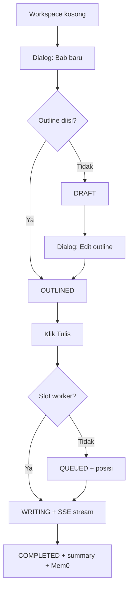
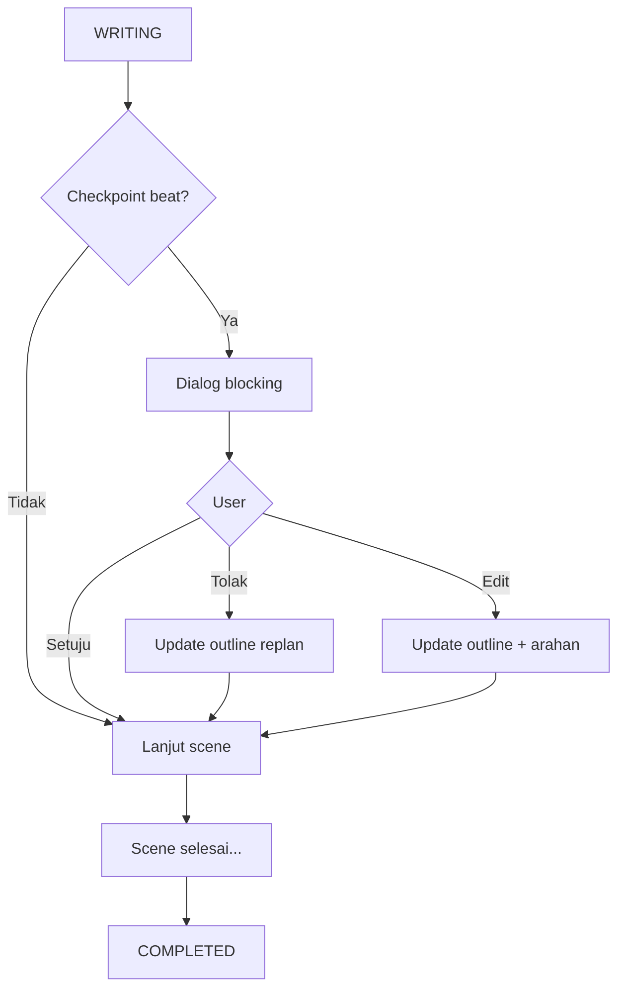
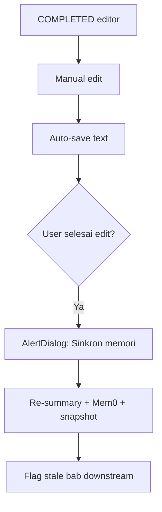
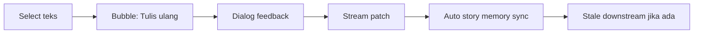
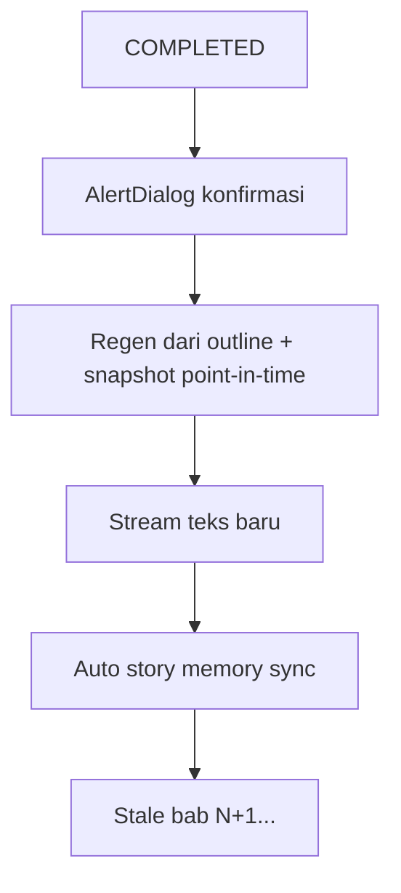
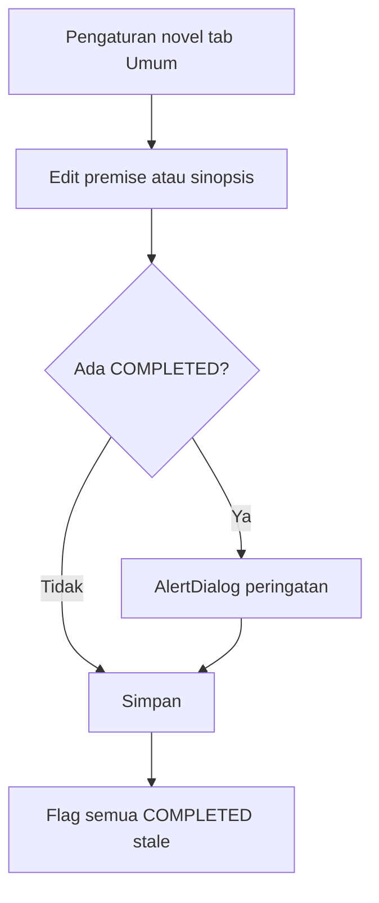
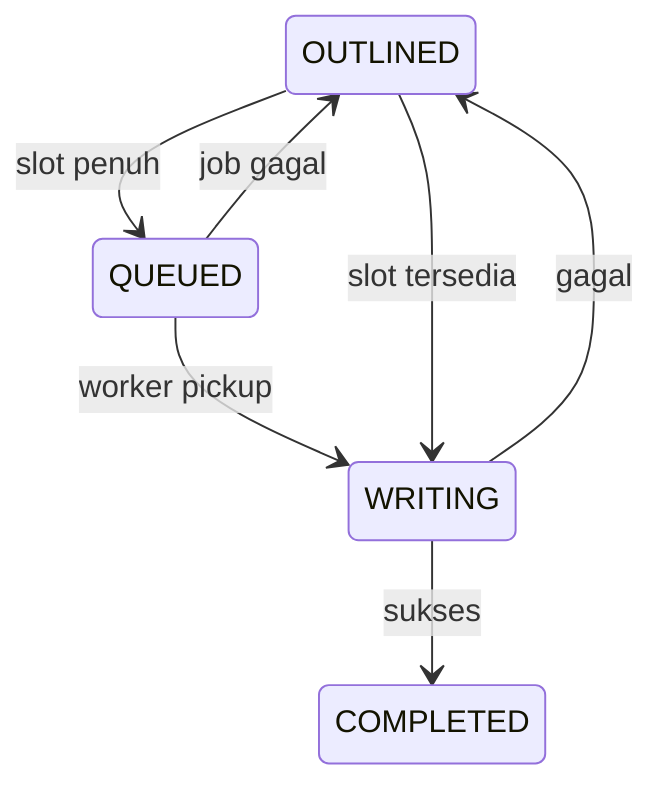

# User Flows

Alur utama v1. Istilah domain: [`CONTEXT.md`](../../CONTEXT.md).

---

## 1. Onboarding

```mermaid
flowchart LR
  A[Landing /] --> B{Session?}
  B -->|Tidak| C[/login]
  B -->|Ya| D[/novels]
  C -->|Daftar| D
  C -->|Masuk| D
```

1. User buka app → redirect `/login` atau `/novels`
2. Tab **Daftar**: display name, email, password → Supabase signup
3. Langsung masuk library (tanpa verifikasi email)

---

## 2. Buat novel pertama

```mermaid
flowchart TD
  A[/novels empty] --> B[Dialog: Novel baru]
  B --> C[Isi: judul, genre, bahasa tulis, premise, sinopsis]
  C --> D[POST /api/novels]
  D --> E[/novels/id workspace]
```

**Core context** yang tersimpan dan dipakai generasi: Premise + Synopsis (+ metadata lain).

---

## 3. Tulis bab pertama



Bab 1: tidak perlu Prior chapter text. Macro context = Premise, Synopsis, outline, profiles opsional, Mem0 kosong.

---

## 4. Tulis bab N (N > 1)

Prasyarat: Bab N−1 **COMPLETED**.

Context tambahan vs bab 1:
- **Prior chapter text** (seluruh teks N−1)
- **Recent chapter summaries** (20 terakhir)
- **Retrieved chapter summaries** (top 10)

Flow status sama dengan §3 setelah OUTLINED.

---

## 5. Generasi dengan plot checkpoint



Novel harus opt-in plot checkpoints (tab Lanjutan pengaturan novel).

---

## 6. Edit manual + sinkron memori



Manual edit **tidak** otomatis update memori AI.

---

## 7. Partial rewrite



Tidak diblokir oleh bab yang lebih baru (v1).

---

## 8. Full chapter regeneration



Tidak memakai metadata / derived canon terkini — hanya **Chapter context snapshot** bab tersebut.

---

## 9. Ubah premise / sinopsis



User fix-forward manual; stale bukan blocker untuk tulis bab baru.

---

## 10. Outline drift (tanpa regen)

1. User edit outline bab COMPLETED (modal Edit outline)
2. Chapter text tidak berubah
3. `Alert` **Outline drift** di editor
4. Bab berikutnya **belum** stale
5. Resolve: **Tulis ulang bab** atau revert outline

---

## 11. Arsip & hapus novel

| Aksi | Flow |
|------|------|
| **Arsipkan** | AlertDialog → `archived_at` set → hilang dari Aktif; Tulis disabled |
| **Pulihkan** | Dari tab Arsip → kembali Aktif |
| **Hard delete** | AlertDialog + ketik judul → cascade hapus semua data |

---

## 12. Hapus akun

1. Avatar → Pengaturan akun → Hapus akun
2. AlertDialog + ketik email
3. Cascade semua Novel & data
4. Redirect `/login`

---

## 13. Queue overload



UI: posisi antrian di baris sidebar + panel main saat QUEUED.

User max 1 QUEUED + 1 WRITING pada satu waktu.
